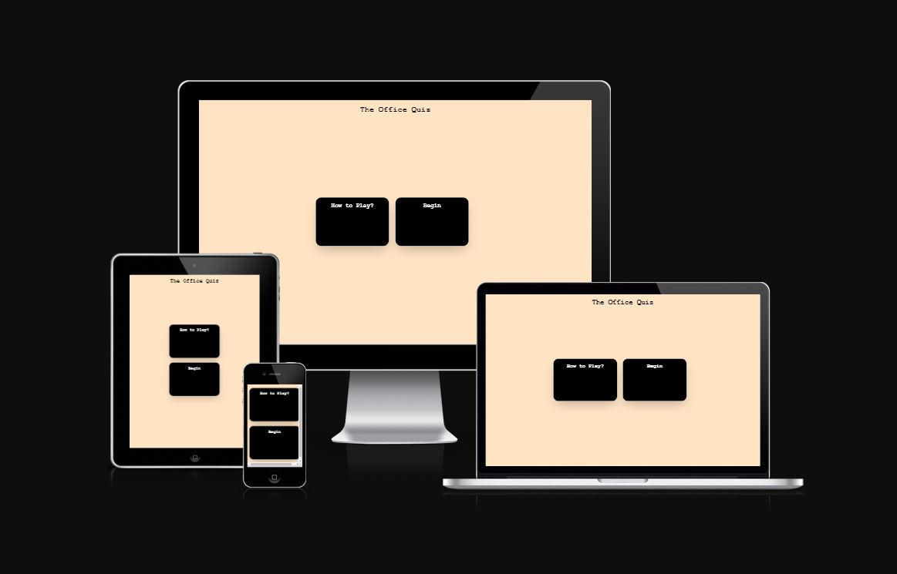
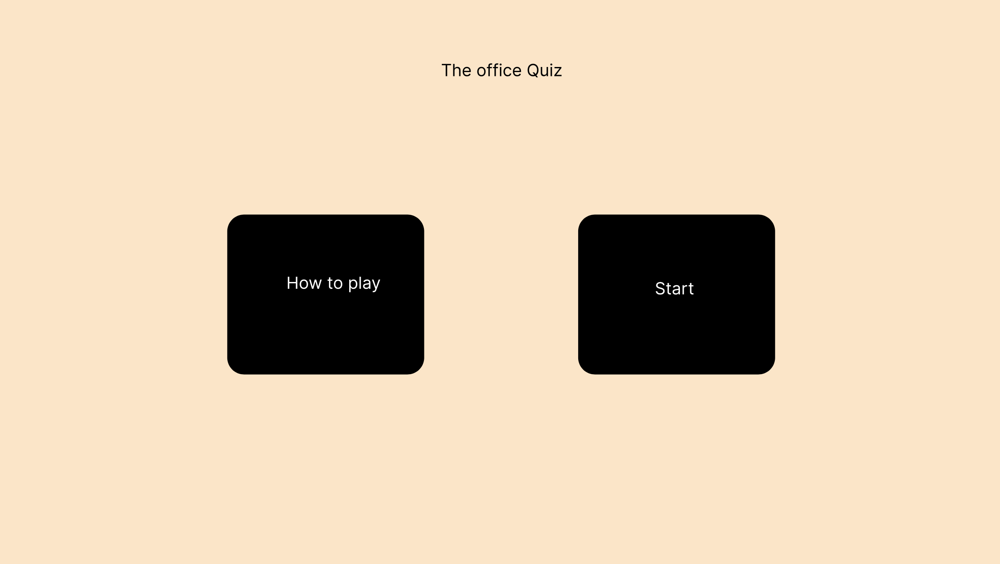
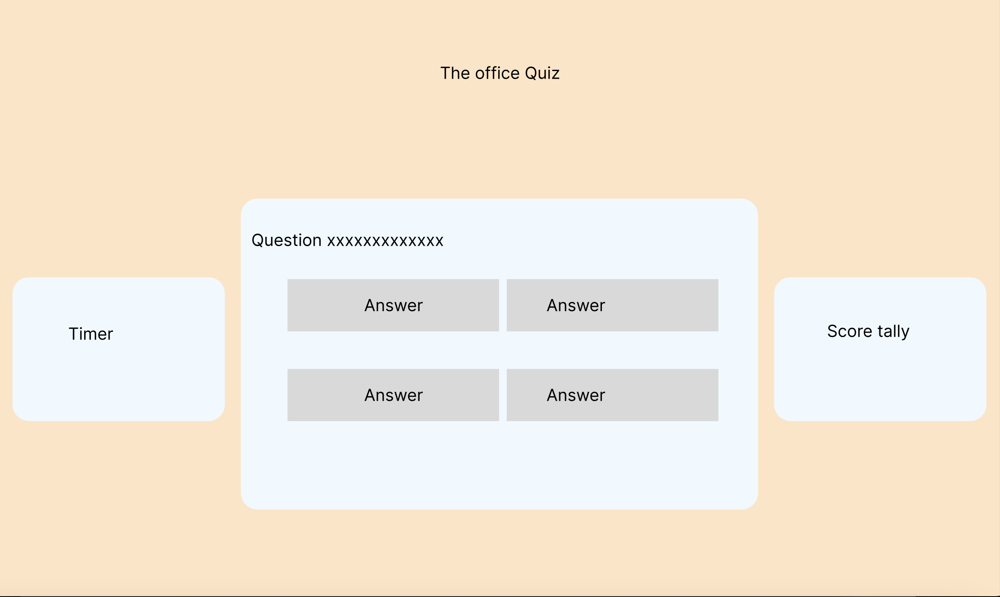
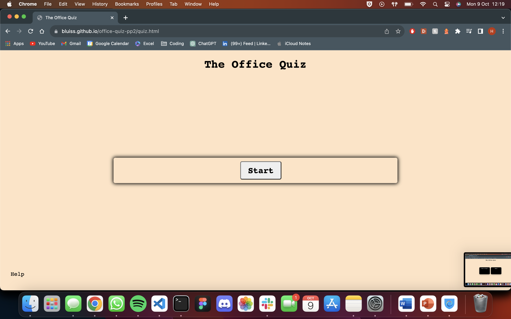
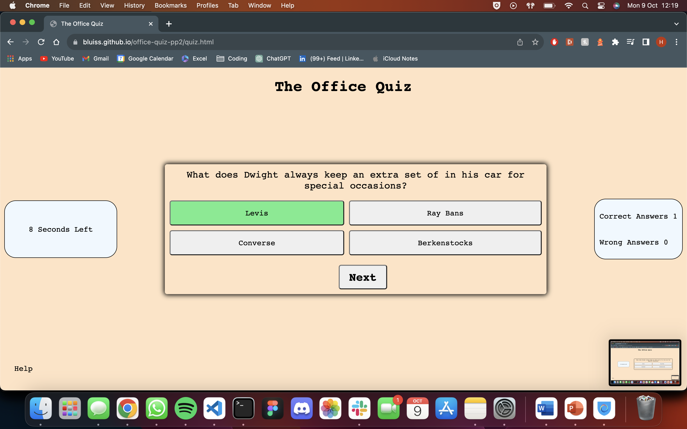
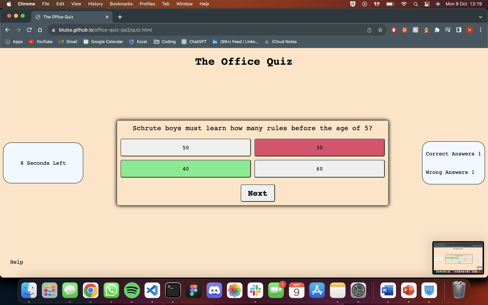
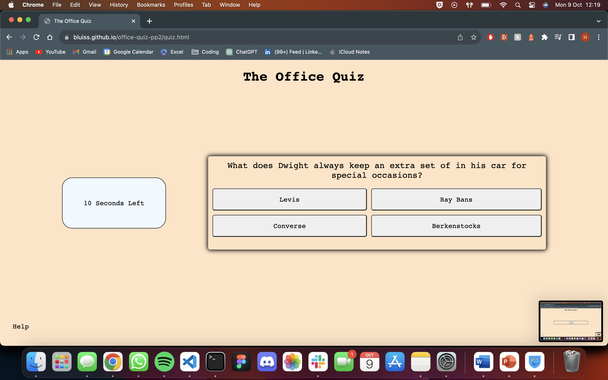

# The Office Quiz

A simple quiz to test your knowledge on the hit tv show, the office (US)

https://bluiss.github.io/office-quiz-pp2/

---

## CONTENTS

* [User Experience](#user-experience-ux)
  * [User Stories](#user-stories)

* [Design](#design)
  * [Colour Scheme](#colour-scheme)
  * [Typography](#typography)
  * [Imagery](#imagery)
  * [Wireframes](#wireframes)

* [Features](#features)
  * [General Features on Each Page](#general-features-on-each-page)
  * [Accessibility](#accessibility)

* [Technologies Used](#technologies-used)
  * [Languages Used](#languages-used)
  * [Frameworks, Libraries & Programs Used](#frameworks-libraries--programs-used)

* [Deployment & Local Development](#deployment--local-development)
  * [Deployment](#deployment)
  * [Local Development](#local-development)
    * [How to Fork](#how-to-fork)
    * [How to Clone](#how-to-clone)

* [Testing](#testing)

* [Credits](#credits)
  * [Code Used](#code-used)
  * [Content](#content)

---

## User Experience (UX)

### Initial Discusion

The Office Quiz is an online quiz that is themed around the US TV show "the office", It aims to test your knowledge around the show and its characters. You are able to keep track of your score as you make complete the quiz.

Key information

- How to play section
- Begin Section
- Scores section
- Question section
- Answer section

### User Stories

# First-time visitors

- Understand what theme the questions relate to
- Understand how to answer questions
- Check the score at the end

# Returning Visitor

- Compare score to last visit

## Design

### Colour Scheme

The color scheme is a collection of pastel colors to emulate the theme of the office intro

### Typography

Google Fonts was used for all fonts:

- Courier, Arial, Helvetica, sans-serif;

### Imagery

- No images were used

### Wireframes

## Features

The website comprises two main pages a welcome page and a quiz page.

### Welcome Page

- The welcome page has two main sections, hovering over how to play highlights a list of rules and tips that aid in playing the quiz
- A simple begin button that directs the user to quiz.html

### Quiz page

- A dynamic field that shows the different questions
- 4 different answers depending on the questions presented
- A timer that counts down from 10, stops when the answer is selected and refreshed when the next button is selected
- A tally that shows either the correct or wrong score
- A final dynamic message that changes depending on the final score of the user
- Reset/Start/Next buttons

 
 
 
### Accessibility

I have been mindful during coding to ensure that the website is as accessible friendly as possible. I have achieved this by:

- Using semantic HTML.
- Contrasting colors and constant feedback

## Technologies Used

### Languages used

- HTML, CSS & JavaScript were used to create this website.

### Frameworks, Libraires & Programs

- Balsamiq - Used to create wireframes.
- Git - For version control.
- Github - To save and store the files for the website.
- Google Fonts - To import the fonts used on the website.
- Google Dev Tools - To troubleshoot and test features, solve issues with responsiveness and styling.
- SweetAlert2 Library

## Deployment & Local Development

👩🏻‍💻 View an example of a completed Deployment & Local Development section [here](https://github.com/kera-cudmore/TheQuizArms#Deployment)

### Deployment

Github Pages was used to deploy the live website. The instructions to achieve this are below:

1. Log in (or sign up) to Github.
2. Find the repository for this project, office-quiz-pp2
3. Click on the Settings link.
4. Click on the Pages link in the left-hand side navigation bar.
5. In the Source section, choose main from the drop down select branch menu. Select Root from the drop down select folder menu.
6. Click Save. Your live Github Pages site is now deployed at the URL shown.

## Local Deployment

### How to Fork

To fork the the office quiz repository:

1. Log in (or sign up) to Github.
2. Go to the repository for this project, bluiss/office-quiz-pp2
3. Click the Fork button in the top right corner.

### How to clone

To clone the office quiz repository:

1. Log in (or sign up) to GitHub.
2. Go to the repository for this project, bluiss/office-quiz-pp2
3. Click on the code button, select whether you would like to clone with HTTPS, SSH or GitHub CLI and copy the link shown.
4. Open the terminal in your code editor and change the current working directory to the location you want to use for the cloned directory.
5. Type 'git clone' into the terminal and then paste the link you copied in step 3. Press enter.

## Testing

Full testing doc here [Testing.MD](TESTING.md)

## Credits

### Code Used

- Framework for question logic - https://github.com/WebDevSimplified/JavaScript-Quiz-App

### Content

Combination of myself and questions pulled from https://www.goodhousekeeping.com/life/entertainment/a40679561/the-office-trivia-quiz/

