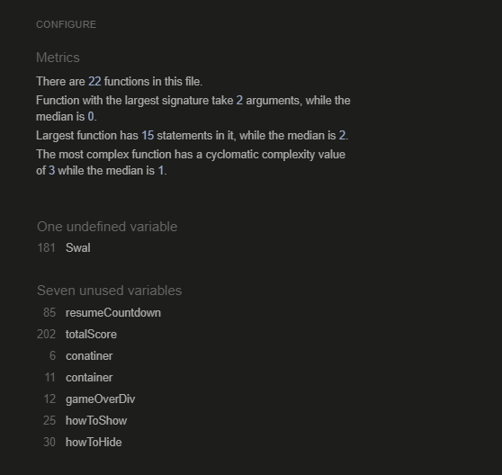

# MILESTONE 2 The office quiz - TESTING

## CONTENTS

* [AUTOMATED TESTING](#automated-testing)
  * [W3C Validator](#w3c-validator)
  * [Lighthouse](#lighthouse)
  * [WAVE](#wave)

* [MANUAL TESTING](#manual-testing)
  * [Testing User Stories](#testing-user-stories)
  * [Full Testing](#full-testing)

* [BUGS](#bugs)
  * [Known Bugs](#known-bugs)
  * [Solved Bugs](#solved-bugs)

---

## AUTOMATED TESTING

The Automated Testing includes all the testing that is carried out by a program, like W3C HTML validation.

###  W3C Validator

index.html - pass

quiz.html -  pass

#### **CSS Validation**

css - pass

### Lighthouse

### JavaScript 

Jshint - pass 

## MANUAL TESTING

### Testing User Stories

| Goals                                         | How are they achieved                                                           | Pass / Fail |
| --------------------------------------------- | ------------------------------------------------------------------------------- | ----------- |
| First time Visitors                           |                                                                                 |             |
| Understand what theme the questions relate to | Lots of office related questions and answers                                    | Pass        |
| Understand how to answer questions            | Ux is intuitive and displays the correct answer if incorrect answer is selected | Pass        |
| Check the score at the end                    | Final message is displayed with total score after final question                | Pass        |
| Returning Visitors                            |                                                                                 |             |
| Compare score to last visit                   | Can check previous score against new score                                      | Pass        |
### Full Testing

Full testing was performed on the following devices:

* Desktop:
  * 24 Inch Monitor
  * 27 Inch Monitor
* Laptop:
  * Macbook Pro 2021 13 inch screen
* Mobile Devices:
  * iPhone 14 pro.
  * iPhone 12 pro.

Each device tested the site using the following browsers:

* Google Chrome
* Safari

| Feature                                                                | Expected Outcome                                                                 | Testing Performed                                                  | Result                                                | Pass/Fail |
| ---------------------------------------------------------------------- | -------------------------------------------------------------------------------- | ------------------------------------------------------------------ | ----------------------------------------------------- | --------- |
| Index.html                                                             |                                                                                  |                                                                    |                                                       |           |
| Begin Div                                                              | Directs the user to the quiz page                                                | Clicked Link                                                       | Correct Direction                                     | Pass      |
| How to div                                                             | Display guide when mouse over and hide when leave                                | Mouseover and leave                                                | How to displays as needed                             | Pass      |
| Quiz.html                                                              |                                                                                  |                                                                    |                                                       |           |
| Start Button                                                           | Starts quiz                                                                      | Clicked                                                            | Starts quiz                                           | Pass      |
| Dynamic Question Field                                                 | Shows questions from array                                                       | Clicked through quiz to display all needed questions               | Shows correct questions                               | Pass      |
| Dynamic answer field                                                   | Show answers from array, related to specifc question                             | Clicked through quiz to display all needed questions 

And answers | Shows correct answers                                 | Pass      |
| Timer                                                                  | Counts down from 10 stops when answer is selected, restarts when next is pressed | Clicked through questions and next button                          | Timer works as needed                                 | Pass      |
| Answer Color changes when correct                                      | Answer button changes to green when correct answer is selcted                    | Correct answer selected                                            | Answer shows as green                                 | Pass      |
| Answer Color changes when incorrect                                    | Answer button changes to red when incorrect answer is selected                   | Incorrect answer selected                                          | Answer shows as red                                   | Pass      |
| Button shows correct answer as green when incorrect answer is selected | Answer button changes to green when incorrect answer is selected                 | Incorrect answer selected                                          | Correct answer shows as green                         | Pass      |
| Next button                                                            | Next button shows next question                                                  | Clicked                                                            | Shows next question                                   | Pass      |
| Running score                                                          | Shows score as questions are answered                                            | Questions answered                                                 | Shows correct/incorrect scores                        | Pass      |
| Final message                                                          | Shows total score and dynamic messahe                                            | Questions answred                                                  | Shows final correct answers and corresponding message | Pass      |
| Restart Button                                                         | Restarts quiz                                                                    | Clicked                                                            | Restarts questions                                    | Pass      |
| Timer alert                                                            | Stops game if timer runs out                                                     | Wait for timer                                                     | Refreshes page                                        | Pass      |

## BUGS

| Known Bugs                                              | Resolved                                                                                                                                                                                                         |
| ------------------------------------------------------- | ---------------------------------------------------------------------------------------------------------------------------------------------------------------------------------------------------------------- |
| Timer and score divs, wouldn’t align on mobile          | Yes, removed margin and increased padding using a media query for smaller screens                                                                                                                                |
| Total score would carry through each reset of questions | Yes, reset innerHTML of those values to 0 on each reset (See JS)                                                                                                                                                 |
| Score would increase by 4                               | only increment scores based on the button that was clicked, not all the buttons.                                                                                                                                 |
| Timer starts when page is loaded                        | Add eventlistner to start button that calls timer function                                                                                                                                                       |
| Final score only shwoing 0                              | You're trying to fetch the correctScore value immediately when the script runs (i.e., before the game starts). Therefore, the correctScore will always be the initial value set in the DOM, which is probably 0. |
|                                                         |                                                                                                                                                                                                                  |
|                                                         |                                                                                                                                                                                                                  |